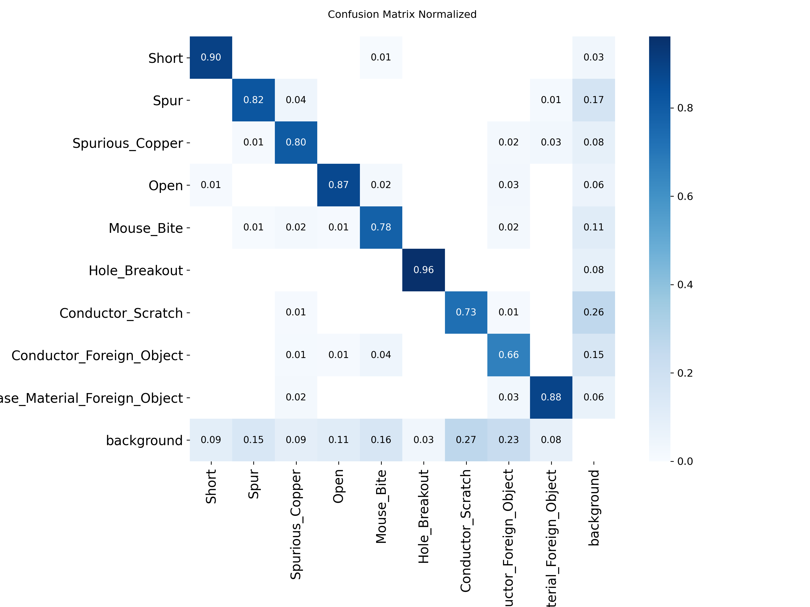
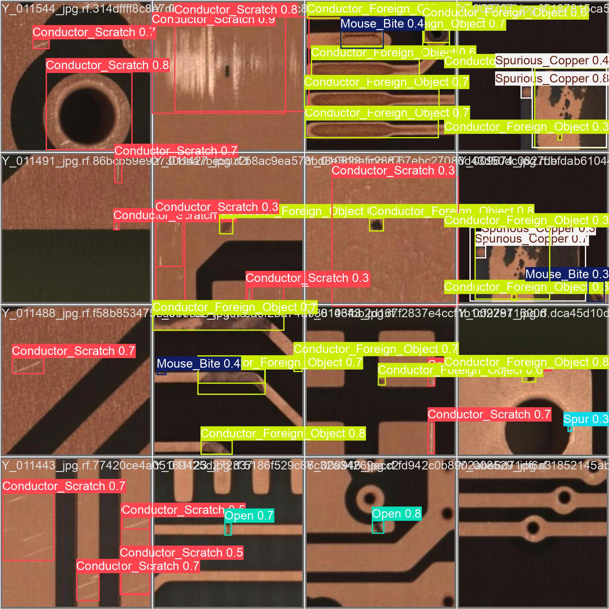
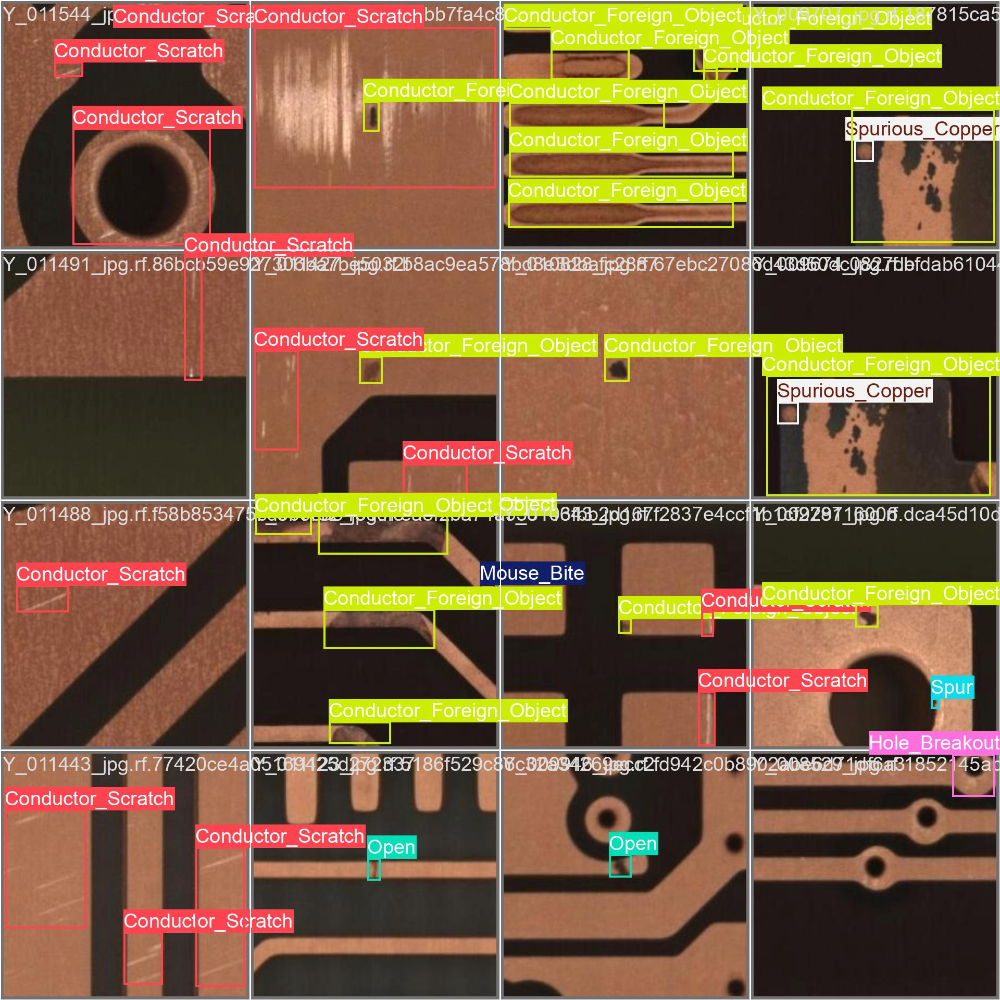
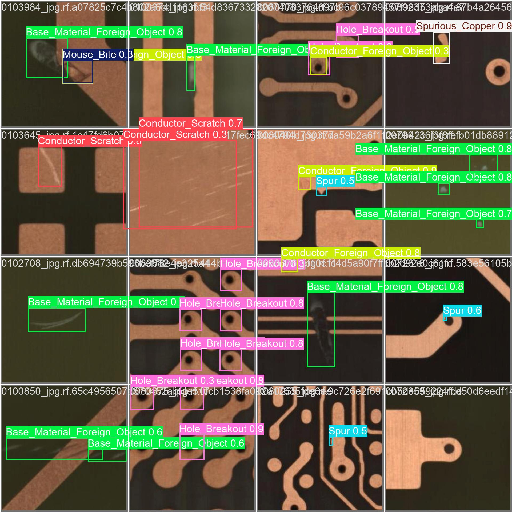
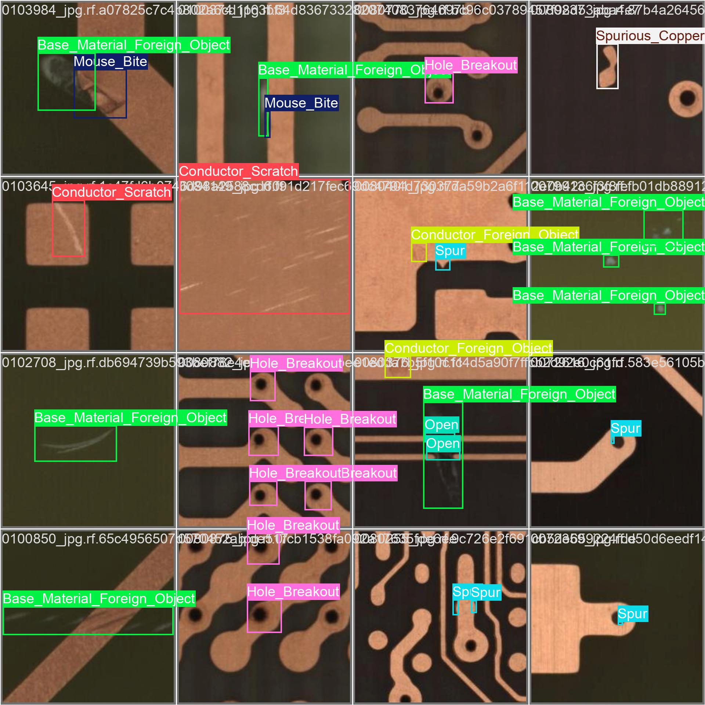
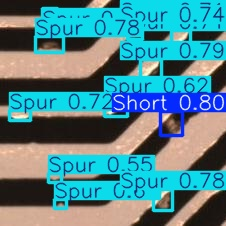
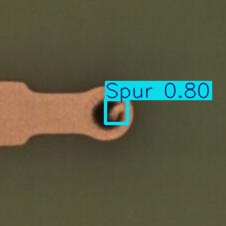
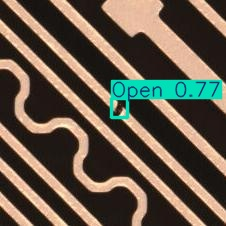

# PCB Defect Detection with YOLO11

Automated quality inspection system for PCB defect detection using YOLO11-L on the DsPCBSD+ dataset.

## Results

| Metric | Value |
|--------|-------|
| **mAP@0.5** | 83.1% |
| **mAP@0.75** | 49.3% |
| **mAP@0.5:0.95** | 48.9% |
| **Precision** | 78.3% |
| **Recall** | 80.4% |
| **Inference Speed** | ~13.4ms/image |

### Per-Class Performance (AP@0.5)

| Class | AP@0.5 |
|-------|--------|
| Hole_Breakout | 98.3% |
| Open | 91.7% |
| Base_Material_Foreign_Object | 87.6% |
| Short | 86.2% |
| Spurious_Copper | 83.9% |
| Spur | 83.7% |
| Mouse_Bite | 82.1% |
| Conductor_Scratch | 68.7% |
| Conductor_Foreign_Object | 65.7% |

### Training Curves


### Confusion Matrix



### Sample Predictions

| Prediction | Ground Truth |
|------------|--------------|
|  |  |
|  |  |

### Detection Examples





## Defect Classes (DsPCBSD+)

| ID | Class | Description |
|----|-------|-------------|
| 0 | Short | Copper bridge between traces |
| 1 | Spur | Protrusion from copper trace |
| 2 | Spurious_Copper | Unwanted copper residue |
| 3 | Open | Break in copper trace |
| 4 | Mouse_Bite | Irregular edge on trace |
| 5 | Hole_Breakout | Hole extending beyond pad |
| 6 | Conductor_Scratch | Physical damage to trace |
| 7 | Conductor_Foreign_Object | Foreign material on conductor |
| 8 | Base_Material_Foreign_Object | Foreign material on substrate |

## Severity Classification

Defect severity is based on **area ratio** (bbox_area / image_area):

| Severity | Area Ratio | Action |
|----------|------------|--------|
| Low | < 0.5% | Log and continue |
| Medium | 0.5% - 2% | Flag for review |
| High | ≥ 2% | Reject immediately |

## Demo Video

> See [videos/demo.mp4](videos/demo.mp4) for real-time inference demo.

## Quick Start

### Setup

```bash
pip install -r requirements.txt
```

### Download Pretrained Weights

```bash
# Download trained model
bash download_weights.sh
```

### Download Dataset

1. Get your Roboflow API key from: https://app.roboflow.com/settings/api

2. Create a `.env` file:
```bash
cp .env.example .env
# Edit .env and add your API key
```

3. Download the dataset:
```bash
python data/download_dspcbsd.py
```

### Training

```bash
python train.py

# Resume training
python train.py --resume
```

### Evaluation

```bash
python evaluate.py --checkpoint outputs/train/weights/best.pt
```

### Inference

```bash
# Analyze single image with coordinates output
python inference.py --image path/to/pcb.jpg --output_image result.jpg --output_json result.json
```

**Sample output:**
```
[1] Short (92.3%)
    Center: (245.5, 312.7)
    BBox: [230.2, 298.5, 260.8, 326.9]
    Severity: Medium (1.25%)
```

### Batch Visualization

```bash
python visualize.py --checkpoint outputs/train/weights/best.pt --num_samples 20
```

## Project Structure

```
Task2_QualityInspection/
├── data/
│   └── DsPCBSD/           # Dataset (download separately)
├── models/
│   └── yolo11l.pt         # Pretrained weights
├── outputs/
│   └── train/weights/
│       ├── best.pt        # Best checkpoint
│       └── last.pt        # Latest checkpoint
├── sample_data/
│   ├── defect_free/       # Defect-free PCB samples
│   └── defective/         # Defective PCB samples with labels
├── train.py               # Training script
├── evaluate.py            # Evaluation metrics
├── inference.py           # Single image inference + JSON output
├── visualize.py           # Batch visualization
├── config.py              # Configuration
└── requirements.txt
```

## Dataset

**DsPCBSD+** (Deep PCB Surface Defect Dataset Plus)
- **Images**: 10,259 with 20,276 annotated defects
- **Classes**: 9 defect types
- **Source**: [Roboflow](https://universe.roboflow.com/pcb-egrla/dspcbsd/dataset/1)
- **License**: CC BY 4.0

## References

```bibtex
@software{Jocher_Ultralytics_YOLO_2023,
    author = {Jocher, Glenn and Qiu, Jing and Chaurasia, Ayush},
    license = {AGPL-3.0},
    month = jan,
    title = {{Ultralytics YOLO}},
    url = {https://github.com/ultralytics/ultralytics},
    version = {8.0.0},
    year = {2023}
}

@misc{
    dspcbsd_dataset,
    title = { DSPCBSD+ Dataset },
    type = { Open Source Dataset },
    author = { pcb },
    howpublished = { \url{ https://universe.roboflow.com/pcb-egrla/dspcbsd } },
    url = { https://universe.roboflow.com/pcb-egrla/dspcbsd },
    journal = { Roboflow Universe },
    publisher = { Roboflow },
    year = { 2024 },
    month = { nov },
    note = { visited on 2026-01-10 },
}
```

## License

MIT